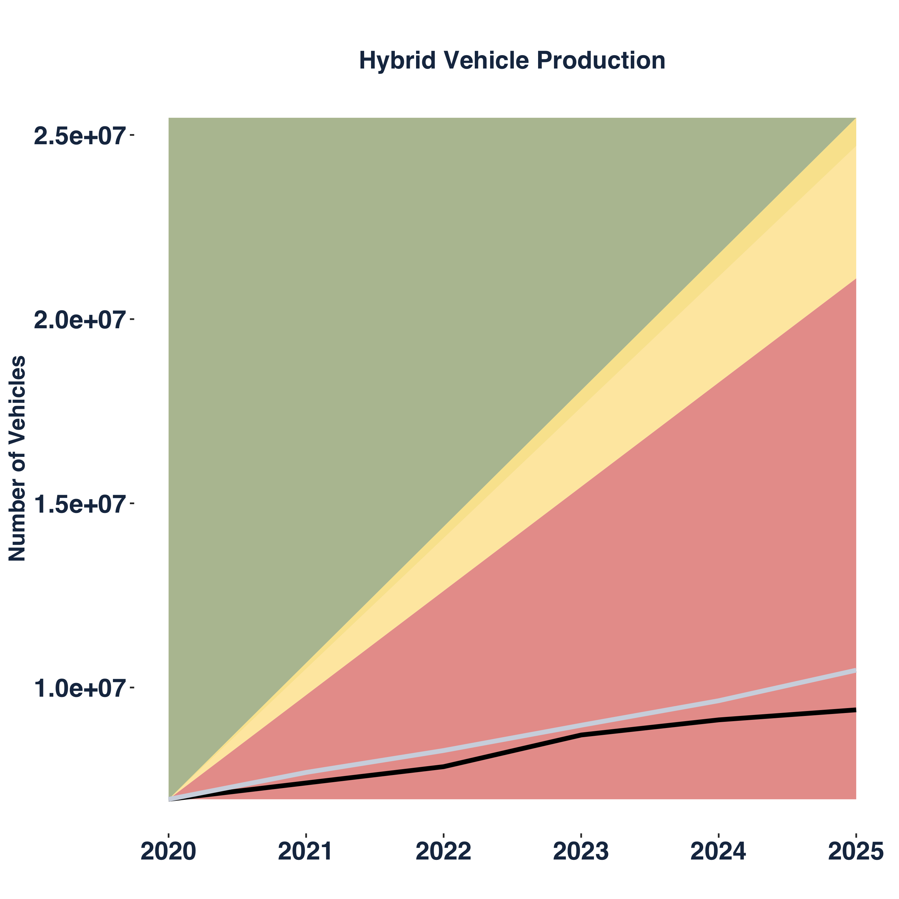

```{r setup, include=FALSE}
knitr::opts_chunk$set(echo = TRUE)
```
<!-- using: bslib
rmarkdown-dev-version: https://github.com/rstudio/rmarkdown/pull/1706
themes bootswatch
-->

<!-- Title -->
<h4 class="display-4"> Climate Alignment of the ECB's Collateral </h4>

<!-- Metadata-container -->
<div class="container">

<!-- Quick Info -->
<div class="container">
<p>

<strong> Research and development: </strong> Fiona Spuler, Jakob Wessel, Santa Claus <br>
<strong> Data sources: </strong> Asset Resolution (?), [List of eligible Assets - ECB](https://www.ecb.europa.eu/paym/coll/assets/html/list-MID.en.html)

</p>
</div>

<br/>

<!-- Text-description -->
<div class="container">

<p class="h5">Introduction</p>

<p> 
"Lorem ipsum dolor sit amet, consectetur adipiscing elit, sed do eiusmod tempor incididunt ut labore et dolore magna aliqua. Ut enim ad minim veniam, quis nostrud exercitation ullamco laboris nisi ut aliquip ex ea commodo consequat. Duis aute irure dolor in reprehenderit in voluptate velit esse cillum dolore eu fugiat nulla pariatur. Excepteur sint occaecat cupidatat non proident, sunt in culpa qui officia deserunt mollit anim id est laborum."
</p>

</div>

</div>

<br/>

<!-- Time of data-retrieval -->
<div class="alert alert-secondary" role="alert">
<strong>Data: </strong> ECB Collateral list for the: <span class="text-danger"> 03.02.20 </span>. Retrieved from [List of eligible Assets - ECB](https://www.ecb.europa.eu/paym/coll/assets/html/list-MID.en.html)
</div>


<!-- Vertical divider -->

<hr>

<!-- Main part -->

<!-- Overview -->
<div class="container">
<div class="card-group"> <!-- useful? --> 


<div class="card">

<div class="card-body">
<h5 class="card-title">Coal</h5>
<p class="card-text">This is a wider card with supporting text below as a natural lead-in to additional content. This content is a little bit longer.</p>
<p class="card-text"><small class="text-muted">Last updated 3 mins ago</small></p>
</div>


</div>


<div class="card">

<div class="card-body">
<h5 class="card-title">Hybrid</h5>
<p class="card-text">This is a wider card with supporting text below as a natural lead-in to additional content. This content is a little bit longer.</p>
<p class="card-text"><small class="text-muted">Last updated 3 mins ago</small></p>
</div>


</div>


<div class="card">

<div class="card-body">
<h5 class="card-title"><button type="button" class="btn btn-danger">Oil</button></h5>
<p class="card-text">This is a wider card with supporting text below as a natural lead-in to additional content. This content is a little bit longer.</p>
<p class="card-text"><small class="text-muted">Last updated 3 mins ago</small></p>
</div>


</div>


</div>
</div>

<hr>

<!-- Methodology -->
<div class="border border-warning">

<div class="container rounded">

<h1 class="display-4">Fluid jumbotron</h1>
<p class="lead">This is a modified jumbotron that occupies the entire horizontal space of its parent.</p>
</div>
</div>


<div class="jumbotron jumbotron-fluid">
<div class="container">
<h1 class="display-4">Fluid jumbotron</h1>
<p class="lead">This is a modified jumbotron that occupies the entire horizontal space of its parent.</p>
</div>
</div>

<hr>

<!-- Standard-component --> 


