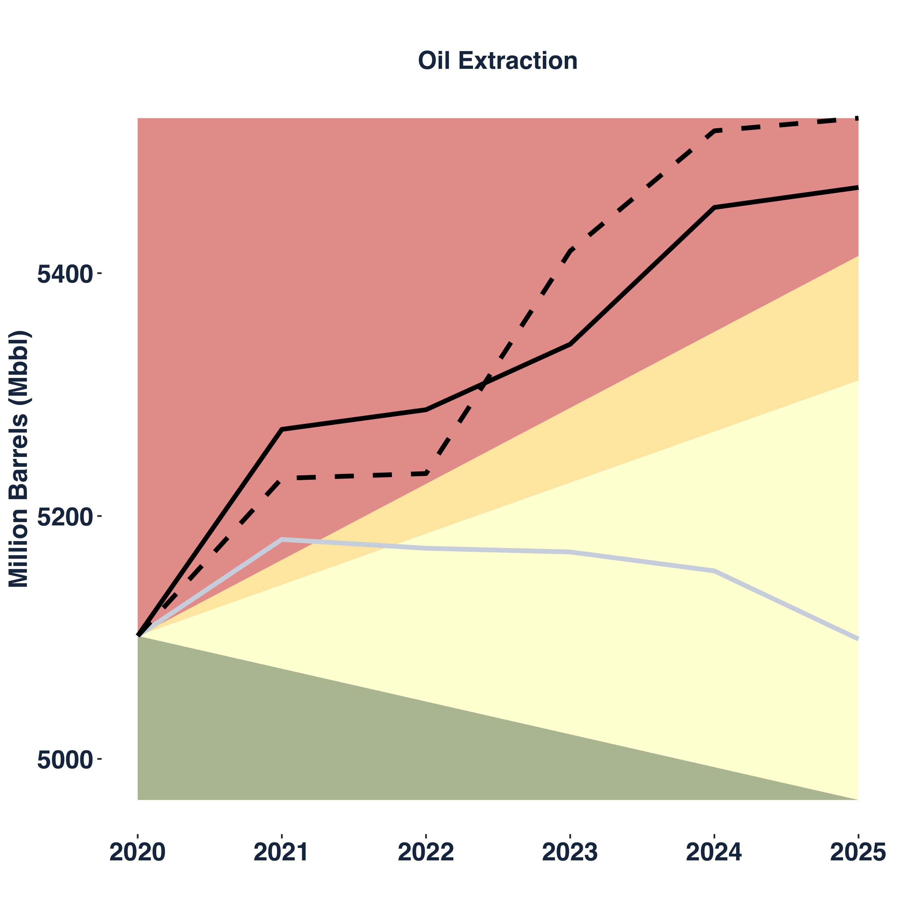

```{r setup, include=FALSE}
knitr::opts_chunk$set(echo = TRUE)
```

```{r echo=FALSE, eval=TRUE}
#load metadata
library("yaml")
collateral_date <- read_yaml("metadata.yml")$collateral_date
```

<!-- using: bslib, htmltools
rmarkdown-dev-version: https://github.com/rstudio/rmarkdown/pull/1706
themes bootswatch
-->


<!-- Metadata-container -->

<!-- Quick Info -->
<p>

<br/>
<strong> Research and development: </strong> Fiona Spuler, Jakob Wessel, Santa Claus <br/>
<strong> Data sources: </strong> Asset Resolution (?), [List of eligible Assets - ECB](https://www.ecb.europa.eu/paym/coll/assets/html/list-MID.en.html) <br/>
<em> Analysed with [PACTA](https://www.transitionmonitor.com/) </em>

</p>


<br/>

<!-- Text-description -->
<div class="container-fluid">

<p class="h5">Introduction</p>
<p> 
"Lorem ipsum dolor sit amet, consectetur adipiscing elit, sed do eiusmod tempor incididunt ut labore et dolore magna aliqua. Ut enim ad minim veniam, quis nostrud exercitation ullamco laboris nisi ut aliquip ex ea commodo consequat. Duis aute irure dolor in reprehenderit in voluptate velit esse cillum dolore eu fugiat nulla pariatur. Excepteur sint occaecat cupidatat non proident, sunt in culpa qui officia deserunt mollit anim id est laborum."
</p>

</div>


<br/>

<!-- Time of data-retrieval -->
<div class="alert alert-secondary" role="alert">
<strong>Data: </strong> ECB Collateral list for the: <span class="text-danger"> `r collateral_date` </span>. Retrieved from [List of eligible Assets - ECB](https://www.ecb.europa.eu/paym/coll/assets/html/list-MID.en.html)
</div>

<div class="container"> 
<h2> Key findings </h2>
<p>
<ul>
<li> Key finding 1 (worst sectors/relevant ones + Legende)</li>
<li> Key finding 2</li>
<li> Key finding 3</li>
</ul>
</p>
</div>

<!-- Vertical divider -->

<hr>

<!-- Main part -->

<!-- Overview -->
<div class="container">
<div class="card-group"> 


<div class="card">

<div class="card-body">
<h5 class="card-title">Coal</h5>
<p class="card-text">This is a wider card with supporting text below as a natural lead-in to additional content. This content is a little bit longer.</p>
<p class="card-text"><small class="text-muted">Last updated 3 mins ago</small></p>
</div>


</div>


<div class="card">

<div class="card-body">
<h5 class="card-title">Hybrid</h5>
<p class="card-text">This is a wider card with supporting text below as a natural lead-in to additional content. This content is a little bit longer.</p>
<p class="card-text"><small class="text-muted">Last updated 3 mins ago</small></p>
</div>


</div>


<div class="card">

<div class="card-body">
<h5 class="card-title"><button type="button" class="btn btn-danger" href="#oil_and_gas">Oil</button></h5>
<p class="card-text">This is a wider card with supporting text below as a natural lead-in to additional content. This content is a little bit longer.</p>
<p class="card-text"><small class="text-muted">Last updated 3 mins ago</small></p>
</div>


</div>


</div>
</div>

<!-- End Beginning-Section -->


<br/>
<hr>


<!-- Methodology -->
<div class="jumbotron jumbotron-fluid">
<div class="container">
<h1>Methodology</h1>
<p class="lead">This is a modified jumbotron that occupies the entire horizontal space of its parent.</p>
</div>
</div>


<hr>

<!-- Standard-components --> 


<!-- Oil and Gas --> 

<!-- Intro about the sector --> 
<div class="container">
<h1> <a id="oil_and_gas">Oil & Gas</a></h1>
<p> 
Here we (aka Fiona) add some fancy text, to show how intelligent we (aka Fiona) are and how much we know about this sector. Just like "Lorem ipsum dolor sit amet, consectetur adipiscing elit, sed do eiusmod tempor incididunt ut labore et dolore magna aliqua. Ut enim ad minim veniam, quis nostrud exercitation ullamco laboris nisi ut aliquip ex ea commodo consequat. Duis aute irure dolor in reprehenderit in voluptate velit esse cillum dolore eu fugiat nulla pariatur. Excepteur sint occaecat cupidatat non proident, sunt in culpa qui officia deserunt mollit anim id est laborum."
</p>
</div>

<!-- Alignment-message - same color as szenario? --> 
<div class="alert alert-danger" role="alert">
You are not aligned!!! 
</div>

<br/>

<!-- Five Year charts -->
<div class="container">
<div class="row">
<div class="col-sm">

</div>
<div class="col-sm">

</div>
</div>
</div>

<!-- Alternative:


-->

<br/>

<!-- Results, Interpretation + Haircut -->
<div class="container">
<p> Some fancy text explaing our results eg. haircut <strong> 2030 </strong> 
Here we add some fancy text, to show how intelligent we are and how much we know about this sector. Just like "Lorem ipsum dolor sit amet, consectetur adipiscing elit, sed do eiusmod tempor incididunt ut labore et dolore magna aliqua. Ut enim ad minim veniam, quis nostrud exercitation ullamco laboris nisi ut aliquip ex ea commodo consequat. Duis aute irure dolor in reprehenderit in voluptate velit esse cillum dolore eu fugiat nulla pariatur. Excepteur sint occaecat cupidatat non proident, sunt in culpa qui officia deserunt mollit anim id est laborum."
</p>
</div>
<br/>
<br/>
 
<!-- Companies and Oil+Gas-Worldmap -->
<div class="container">
<div class="row">

<!-- Column with Companies -->
<div class="col">

</div>

<!-- Column with Maps -->
<div class="col">
<!-- Tabs for Maps -->
<ul class="nav nav-tabs" id="myTab" role="tablist">

<!-- Navigation - Maps -->
<li class="nav-item">
<a class="nav-link active" id="oil_map-tab" data-toggle="tab" href="#oil_map" role="tab" aria-controls="oil_map" aria-selected="true">Oil - worldmap</a>
</li>
<li class="nav-item">
<a class="nav-link" id="gas_map-tab" data-toggle="tab" href="#gas_map" role="tab" aria-controls="gas_map" aria-selected="false">Gas - worldmap</a>
</li>
</ul>

<!-- Content - Maps -->
<div class="tab-content" id="myTabContent">

<div class="tab-pane fade show active" id="oil_map" role="tabpanel" aria-labelledby="oil_map-tab">

</div>
<div class="tab-pane fade" id="gas_map" role="tabpanel" aria-labelledby="gas_map-tab">

</div>

</div>

</div>

</div>
</div>

